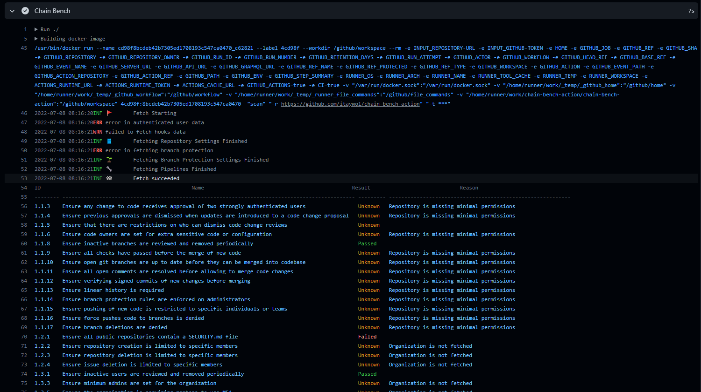

# Chain Bench Action

> [Github Action][github-actions] for [Chain Bench][chain-bench]

[![License][license-img]][license]




## Table Of Contents
- [Chain Bench Action](#chain-bench-action)
  - [Table Of Contents](#table-of-contents)
  - [Usage](#usage)
    - [Workflow](#workflow)
  - [Action](#action)
    - [Inputs](#inputs)
    - [Outputs](#outputs)


## Usage

### Workflow

```yaml
on: [push]

jobs:
  chain_bench_scan_example:
    runs-on: ubuntu-latest
    name: Test Job
    steps:
      - name: Chain Bench
        id: chain-bench
        uses: aquasecurity/chain-bench-action@v1
        with:
          repository-url: ${{ github.server_url }}/${{ github.repository }} # Compiles to https://github.com/aquasecurity/chain-bench-action
          github-token: ${{ secrets.GITHUB_TOKEN }}

      # Using the github action output from the scan step "chain-bench-result"
      - name: Echo
        run: echo ${{ steps.chain-bench.outputs.chain-bench-result }}

```

## Action

### Inputs

Following inputs
| input          | description                          | required |
|----------------|--------------------------------------|----------|
| repository-url | The full repository url to scan      | True     |
| github-token   | The github token to use for scanning | True     |

### Outputs

| output             | description                  |
|--------------------|------------------------------|
| chain-bench-result | JSON output from chain-bench |


[github-actions]: https://github.com/features/actions
[chain-bench]: https://github.com/aquasecurity/chain-bench
[license]: https://github.com/itaywol/chain-bench-action/blob/master/LICENSE
[license-img]: https://img.shields.io/github/license/itaywol/chain-bench-action